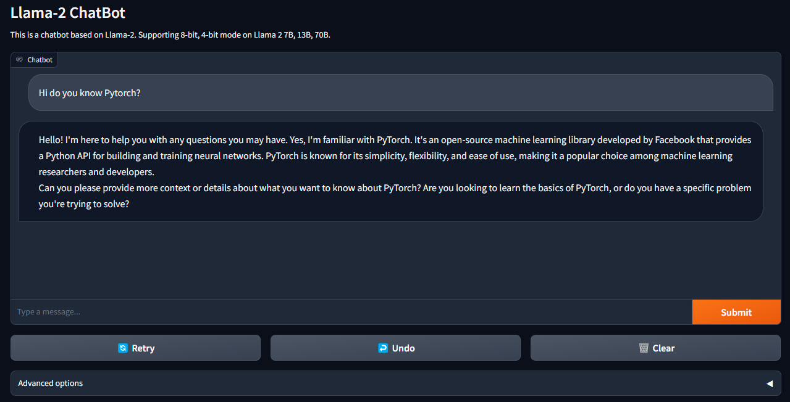

# llama2-webui

Running Llama 2 with gradio web UI on GPU or CPU from anywhere (Linux/Windows/Mac). 
- Supporting all Llama 2 models (7B, 13B, 70B, GPTQ, GGML, GGUF, [CodeLlama](https://huggingface.co/TheBloke/CodeLlama-7B-Instruct-GPTQ)) with 8-bit, 4-bit mode. 
- Use [llama2-wrapper](https://pypi.org/project/llama2-wrapper/) as your local llama2 backend for Generative Agents/Apps; [colab example](./colab/Llama_2_7b_Chat_GPTQ.ipynb). 
- [Run OpenAI Compatible API](#start-openai-compatible-api) on Llama2 models.




## Features

- Supporting models: [Llama-2-7b](https://huggingface.co/meta-llama/Llama-2-7b-chat-hf)/[13b](https://huggingface.co/llamaste/Llama-2-13b-chat-hf)/[70b](https://huggingface.co/llamaste/Llama-2-70b-chat-hf), [Llama-2-GPTQ](https://huggingface.co/TheBloke/Llama-2-7b-Chat-GPTQ), [Llama-2-GGML](https://huggingface.co/TheBloke/Llama-2-7B-Chat-GGML),  [Llama-2-GGUF](https://huggingface.co/TheBloke/Llama-2-7b-Chat-GGUF),  [CodeLlama](https://huggingface.co/TheBloke/CodeLlama-7B-Instruct-GPTQ) ...
- Supporting model backends: [tranformers](https://github.com/huggingface/transformers), [bitsandbytes(8-bit inference)](https://github.com/TimDettmers/bitsandbytes), [AutoGPTQ(4-bit inference)](https://github.com/PanQiWei/AutoGPTQ), [llama.cpp](https://github.com/ggerganov/llama.cpp)
- Demos: [Run Llama2 on MacBook Air](https://twitter.com/liltom_eth/status/1682791729207070720?s=20); [Run Llama2 on free Colab T4 GPU](./colab/Llama_2_7b_Chat_GPTQ.ipynb)
- Use  [llama2-wrapper](https://pypi.org/project/llama2-wrapper/)  as your local llama2 backend for Generative Agents/Apps; [colab example](./colab/Llama_2_7b_Chat_GPTQ.ipynb).  
- [Run OpenAI Compatible API](#start-openai-compatible-api) on Llama2 models.
- [News](./docs/news.md), [Benchmark](./docs/performance.md), [Issue Solutions](./docs/issues.md)

## Contents

- [Install](#install)
- [Usage](#usage)
  - [Start Chat UI](#start-chat-ui)
  - [Start Code Llama UI](#start-code-llama-ui)
  - [Use llama2-wrapper for Your App](#use-llama2-wrapper-for-your-app)
  - [Start OpenAI Compatible API](#start-openai-compatible-api)
- [Benchmark](#benchmark)
- [Download Llama-2 Models](#download-llama-2-models)
  - [Model List](#model-list)
  - [Download Script](#download-script)
- [Tips](#tips)
  - [Env Examples](#env-examples)
  - [Run on Nvidia GPU](#run-on-nvidia-gpu)
    - [Run bitsandbytes 8 bit](#run-bitsandbytes-8-bit)
    - [Run GPTQ 4 bit](#run-gptq-4-bit)
  - [Run on CPU](#run-on-cpu)
    - [Mac Metal Acceleration](#mac-metal-acceleration)
    - [AMD/Nvidia GPU Acceleration](#amdnvidia-gpu-acceleration)
- [License](#license)
- [Contributing](#contributing)


## Install
### Method 1: From [PyPI](https://pypi.org/project/llama2-wrapper/)
```
pip install llama2-wrapper
```
The newest `llama2-wrapper>=0.1.14` supports llama.cpp's `gguf` models.

If you would like to use old `ggml` models, install `llama2-wrapper<=0.1.13` or manually install `llama-cpp-python==0.1.77`.

### Method 2: From Source:

```
git clone https://github.com/liltom-eth/llama2-webui.git
cd llama2-webui
pip install -r requirements.txt
```
### Install Issues:
`bitsandbytes >= 0.39` may not work on older NVIDIA GPUs. In that case, to use `LOAD_IN_8BIT`, you may have to downgrade like this:

-  `pip install bitsandbytes==0.38.1`

`bitsandbytes` also need a special install for Windows:

```
pip uninstall bitsandbytes
pip install https://github.com/jllllll/bitsandbytes-windows-webui/releases/download/wheels/bitsandbytes-0.41.0-py3-none-win_amd64.whl
```

## Usage

### Start Chat UI

Run chatbot simply with web UI:

```bash
python app.py
```

`app.py` will load the default config `.env` which uses `llama.cpp` as the backend to run `llama-2-7b-chat.ggmlv3.q4_0.bin` model for inference. The model `llama-2-7b-chat.ggmlv3.q4_0.bin` will be automatically downloaded.

```bash
Running on backend llama.cpp.
Use default model path: ./models/llama-2-7b-chat.Q4_0.gguf
Start downloading model to: ./models/llama-2-7b-chat.Q4_0.gguf
```

You can also customize your `MODEL_PATH`, `BACKEND_TYPE,` and model configs in `.env` file to run different llama2 models on different backends (llama.cpp, transformers, gptq). 

### Start Code Llama UI

We provide a code completion / filling UI for Code Llama.

Base model **Code Llama** and extend model **Code Llama — Python** are not fine-tuned to follow instructions. They should be prompted so that the expected answer is the natural continuation of the prompt. That means these two models focus on code filling and code completion.

Here is an example run CodeLlama code completion on llama.cpp backend:

``` 
python code_completion.py --model_path ./models/codellama-7b.Q4_0.gguf
```


`codellama-7b.Q4_0.gguf` can be downloaded from [TheBloke/CodeLlama-7B-GGUF](https://huggingface.co/TheBloke/CodeLlama-7B-GGUF/blob/main/codellama-7b.Q4_0.gguf).

**Code Llama — Instruct** trained with “natural language instruction” inputs paired with anticipated outputs. This strategic methodology enhances the model’s capacity to grasp human expectations in prompts. That means instruct models can be used in a chatbot-like app.

Example run CodeLlama chat on gptq backend:

```
python app.py --backend_type gptq --model_path ./models/CodeLlama-7B-Instruct-GPTQ/ --share True
```


`CodeLlama-7B-Instruct-GPTQ` can be downloaded from [TheBloke/CodeLlama-7B-Instruct-GPTQ](https://huggingface.co/TheBloke/CodeLlama-7B-Instruct-GPTQ)

### Use llama2-wrapper for Your App

🔥 For developers, we released `llama2-wrapper`  as a llama2 backend wrapper in [PYPI](https://pypi.org/project/llama2-wrapper/).

Use  `llama2-wrapper`  as your local llama2 backend to answer questions and more, [colab example](./colab/ggmlv3_q4_0.ipynb):

```python
# pip install llama2-wrapper
from llama2_wrapper import LLAMA2_WRAPPER, get_prompt 
llama2_wrapper = LLAMA2_WRAPPER()
# Default running on backend llama.cpp.
# Automatically downloading model to: ./models/llama-2-7b-chat.ggmlv3.q4_0.bin
prompt = "Do you know Pytorch"
answer = llama2_wrapper(get_prompt(prompt), temperature=0.9)
```

Run gptq llama2 model on Nvidia GPU, [colab example](./colab/Llama_2_7b_Chat_GPTQ.ipynb):

```python
from llama2_wrapper import LLAMA2_WRAPPER 
llama2_wrapper = LLAMA2_WRAPPER(backend_type="gptq")
# Automatically downloading model to: ./models/Llama-2-7b-Chat-GPTQ
```

Run llama2 7b with bitsandbytes 8 bit with a `model_path`:

```python
from llama2_wrapper import LLAMA2_WRAPPER 
llama2_wrapper = LLAMA2_WRAPPER(
	model_path = "./models/Llama-2-7b-chat-hf",
  backend_type = "transformers",
  load_in_8bit = True
)
```
Check [API Document](https://pypi.org/project/llama2-wrapper/) for more usages.

### Start OpenAI Compatible API

`llama2-wrapper` offers a web server that acts as a drop-in replacement for the OpenAI API. This allows you to use Llama2 models with any OpenAI compatible clients, libraries or services, etc.

Start Fast API:

```
python -m llama2_wrapper.server
```

it will use `llama.cpp` as the backend by default to run `llama-2-7b-chat.ggmlv3.q4_0.bin` model.

Start Fast API for `gptq` backend:

```
python -m llama2_wrapper.server --backend_type gptq
```

Navigate to http://localhost:8000/docs to see the OpenAPI documentation.

#### Basic settings

| Flag             | Description                                                  |
| ---------------- | ------------------------------------------------------------ |
| `-h`, `--help`   | Show this help message.                                      |
| `--model_path`   | The path to the model to use for generating completions.     |
| `--backend_type` | Backend for llama2, options: llama.cpp, gptq, transformers   |
| `--max_tokens`   | Maximum context size.                                        |
| `--load_in_8bit` | Whether to use bitsandbytes to run model in 8 bit mode (only for transformers models). |
| `--verbose`      | Whether to print verbose output to stderr.                   |
| `--host`         | API address                                                  |
| `--port`         | API port                                                     |

## Benchmark

Run benchmark script to compute performance on your device, `benchmark.py` will load the same `.env` as `app.py`.:

```bash
python benchmark.py
```

You can also select the `iter`, `backend_type` and `model_path` the benchmark will be run (overwrite .env args) :

```bash
python benchmark.py --iter NB_OF_ITERATIONS --backend_type gptq
```

 By default, the number of iterations is 5, but if you want a faster result or a more accurate one 
 you can set it to whatever value you want, but please only report results with at least 5 iterations.

This [colab example](./colab/Llama_2_7b_Chat_GPTQ.ipynb) also show you how to benchmark gptq model on free Google Colab T4 GPU.

Some benchmark performance:

| Model                       | Precision | Device             | RAM / GPU VRAM | Speed (tokens/sec) | load time (s) |
| --------------------------- | --------- | ------------------ | -------------- | ------------------ | ------------- |
| Llama-2-7b-chat-hf          | 8 bit     | NVIDIA RTX 2080 Ti | 7.7 GB VRAM    | 3.76               | 641.36        |
| Llama-2-7b-Chat-GPTQ        | 4 bit     | NVIDIA RTX 2080 Ti | 5.8 GB VRAM    | 18.85              | 192.91        |
| Llama-2-7b-Chat-GPTQ        | 4 bit     | Google Colab T4    | 5.8 GB VRAM    | 18.19              | 37.44         |
| llama-2-7b-chat.ggmlv3.q4_0 | 4 bit     | Apple M1 Pro CPU   | 5.4 GB RAM     | 17.90              | 0.18          |
| llama-2-7b-chat.ggmlv3.q4_0 | 4 bit     | Apple M2 CPU       | 5.4 GB RAM     | 13.70              | 0.13          |
| llama-2-7b-chat.ggmlv3.q4_0 | 4 bit     | Apple M2 Metal     | 5.4 GB RAM     | 12.60              | 0.10          |
| llama-2-7b-chat.ggmlv3.q2_K | 2 bit     | Intel i7-8700      | 4.5 GB RAM     | 7.88               | 31.90         |

Check/contribute the performance of your device in the full [performance doc](./docs/performance.md).

## Download Llama-2 Models

Llama 2 is a collection of pre-trained and fine-tuned generative text models ranging in scale from 7 billion to 70 billion parameters.

Llama-2-7b-Chat-GPTQ is the GPTQ model files for [Meta's Llama 2 7b Chat](https://huggingface.co/meta-llama/Llama-2-7b-chat-hf). GPTQ 4-bit Llama-2 model require less GPU VRAM to run it.

### Model List

| Model Name                          | set MODEL_PATH in .env                   | Download URL                                                 |
| ----------------------------------- | ---------------------------------------- | ------------------------------------------------------------ |
| meta-llama/Llama-2-7b-chat-hf       | /path-to/Llama-2-7b-chat-hf              | [Link](https://huggingface.co/llamaste/Llama-2-7b-chat-hf)   |
| meta-llama/Llama-2-13b-chat-hf      | /path-to/Llama-2-13b-chat-hf             | [Link](https://huggingface.co/llamaste/Llama-2-13b-chat-hf)  |
| meta-llama/Llama-2-70b-chat-hf      | /path-to/Llama-2-70b-chat-hf             | [Link](https://huggingface.co/llamaste/Llama-2-70b-chat-hf)  |
| meta-llama/Llama-2-7b-hf            | /path-to/Llama-2-7b-hf                   | [Link](https://huggingface.co/meta-llama/Llama-2-7b-hf)      |
| meta-llama/Llama-2-13b-hf           | /path-to/Llama-2-13b-hf                  | [Link](https://huggingface.co/meta-llama/Llama-2-13b-hf)     |
| meta-llama/Llama-2-70b-hf           | /path-to/Llama-2-70b-hf                  | [Link](https://huggingface.co/meta-llama/Llama-2-70b-hf)     |
| TheBloke/Llama-2-7b-Chat-GPTQ       | /path-to/Llama-2-7b-Chat-GPTQ            | [Link](https://huggingface.co/TheBloke/Llama-2-7b-Chat-GPTQ) |
| TheBloke/Llama-2-7b-Chat-GGUF       | /path-to/llama-2-7b-chat.Q4_0.gguf       | [Link](https://huggingface.co/TheBloke/Llama-2-7b-Chat-GGUF/blob/main/llama-2-7b-chat.Q4_0.gguf) |
| TheBloke/Llama-2-7B-Chat-GGML       | /path-to/llama-2-7b-chat.ggmlv3.q4_0.bin | [Link](https://huggingface.co/TheBloke/Llama-2-7B-Chat-GGML) |
| TheBloke/CodeLlama-7B-Instruct-GPTQ | TheBloke/CodeLlama-7B-Instruct-GPTQ      | [Link](https://huggingface.co/TheBloke/CodeLlama-7B-Instruct-GPTQ) |
| ...                                 | ...                                      | ...                                                          |

Running 4-bit model `Llama-2-7b-Chat-GPTQ` needs GPU with 6GB VRAM. 

Running 4-bit model `llama-2-7b-chat.ggmlv3.q4_0.bin` needs CPU with 6GB RAM. There is also a list of other 2, 3, 4, 5, 6, 8-bit GGML models that can be used from [TheBloke/Llama-2-7B-Chat-GGML](https://huggingface.co/TheBloke/Llama-2-7B-Chat-GGML).

### Download Script

These models can be downloaded through:

```bash
python -m llama2_wrapper.download --repo_id TheBloke/CodeLlama-7B-Python-GPTQ

python -m llama2_wrapper.download --repo_id TheBloke/Llama-2-7b-Chat-GGUF --filename llama-2-7b-chat.Q4_0.gguf --save_dir ./models
```

Or use CMD like:

```bash
# Make sure you have git-lfs installed (https://git-lfs.com)
git lfs install
git clone git@hf.co:meta-llama/Llama-2-7b-chat-hf
```

To download Llama 2 models, you need to request access from [https://ai.meta.com/llama/](https://ai.meta.com/llama/) and also enable access on repos like [meta-llama/Llama-2-7b-chat-hf](https://huggingface.co/meta-llama/Llama-2-7b-chat-hf/tree/main). Requests will be processed in hours.

For GPTQ models like [TheBloke/Llama-2-7b-Chat-GPTQ](https://huggingface.co/TheBloke/Llama-2-7b-Chat-GPTQ), you can directly download without requesting access.

For GGML models like [TheBloke/Llama-2-7B-Chat-GGML](https://huggingface.co/TheBloke/Llama-2-7B-Chat-GGML), you can directly download without requesting access.

## Tips

### Env Examples

There are some examples in `./env_examples/` folder.

| Model Setup                                            | Example .env                |
| ------------------------------------------------------ | --------------------------- |
| Llama-2-7b-chat-hf 8-bit (transformers backend)        | .env.7b_8bit_example        |
| Llama-2-7b-Chat-GPTQ 4-bit (gptq transformers backend) | .env.7b_gptq_example        |
| Llama-2-7B-Chat-GGML 4bit (llama.cpp backend)          | .env.7b_ggmlv3_q4_0_example |
| Llama-2-13b-chat-hf (transformers backend)             | .env.13b_example            |
| ...                                                    | ...                         |

### Run on Nvidia GPU

The running requires around 14GB of GPU VRAM for Llama-2-7b and 28GB of GPU VRAM for Llama-2-13b. 

If you are running on multiple GPUs, the model will be loaded automatically on GPUs and split the VRAM usage. That allows you to run Llama-2-7b (requires 14GB of GPU VRAM) on a setup like 2 GPUs (11GB VRAM each).

#### Run bitsandbytes 8 bit

If you do not have enough memory,  you can set up your `LOAD_IN_8BIT` as `True` in `.env`. This can reduce memory usage by around half with slightly degraded model quality. It is compatible with the CPU, GPU, and Metal backend.

Llama-2-7b with 8-bit compression can run on a single GPU with 8 GB of VRAM, like an Nvidia RTX 2080Ti, RTX 4080, T4, V100 (16GB).

#### Run GPTQ 4 bit

If you want to run 4 bit  Llama-2 model like `Llama-2-7b-Chat-GPTQ`,  you can set up your `BACKEND_TYPE` as `gptq` in `.env` like example `.env.7b_gptq_example`. 

Make sure you have downloaded the 4-bit model from `Llama-2-7b-Chat-GPTQ` and set the `MODEL_PATH` and arguments in `.env` file.

`Llama-2-7b-Chat-GPTQ` can run on a single GPU with 6 GB of VRAM.

If you encounter issue like `NameError: name 'autogptq_cuda_256' is not defined`, please refer to [here](https://huggingface.co/TheBloke/open-llama-13b-open-instruct-GPTQ/discussions/1)
> pip install https://github.com/PanQiWei/AutoGPTQ/releases/download/v0.3.0/auto_gptq-0.3.0+cu117-cp310-cp310-linux_x86_64.whl  

### Run on CPU

Run Llama-2 model on CPU requires [llama.cpp](https://github.com/ggerganov/llama.cpp) dependency and [llama.cpp Python Bindings](https://github.com/abetlen/llama-cpp-python), which are already installed. 


Download GGML models like `llama-2-7b-chat.ggmlv3.q4_0.bin` following [Download Llama-2 Models](#download-llama-2-models) section. `llama-2-7b-chat.ggmlv3.q4_0.bin` model requires at least 6 GB RAM to run on CPU.

Set up configs like `.env.7b_ggmlv3_q4_0_example` from `env_examples` as `.env`.

Run web UI `python app.py` .

#### Mac Metal Acceleration

For Mac users, you can also set up Mac Metal for acceleration, try install this dependencies:

```bash
pip uninstall llama-cpp-python -y
CMAKE_ARGS="-DLLAMA_METAL=on" FORCE_CMAKE=1 pip install -U llama-cpp-python --no-cache-dir
pip install 'llama-cpp-python[server]'
```

or check details:

- [MacOS Install with Metal GPU](https://github.com/abetlen/llama-cpp-python/blob/main/docs/install/macos.md)

#### AMD/Nvidia GPU Acceleration

If you would like to use AMD/Nvidia GPU for acceleration, check this:

- [Installation with OpenBLAS / cuBLAS / CLBlast / Metal](https://github.com/abetlen/llama-cpp-python#installation-with-openblas--cublas--clblast--metal)


## License

MIT - see [MIT License](LICENSE)

This project enables users to adapt it freely for proprietary purposes without any restrictions.

## Contributing

Kindly read our [Contributing Guide](CONTRIBUTING.md) to learn and understand our development process.

### All Contributors

<a href="https://github.com/liltom-eth/llama2-webui/graphs/contributors">
  
</a>

### Review
<a href='https://github.com/repo-reviews/repo-reviews.github.io/blob/main/create.md' target="_blank"></a>

### Star History

[](https://star-history.com/#liltom-eth/llama2-webui&Date)

## Credits

- https://huggingface.co/meta-llama/Llama-2-7b-chat-hf
- https://huggingface.co/spaces/huggingface-projects/llama-2-7b-chat
- https://huggingface.co/TheBloke/Llama-2-7b-Chat-GPTQ
- [https://github.com/ggerganov/llama.cpp](https://github.com/ggerganov/llama.cpp)
- [https://github.com/TimDettmers/bitsandbytes](https://github.com/TimDettmers/bitsandbytes)
- [https://github.com/PanQiWei/AutoGPTQ](https://github.com/PanQiWei/AutoGPTQ)
- [https://github.com/abetlen/llama-cpp-python](https://github.com/abetlen/llama-cpp-python)
